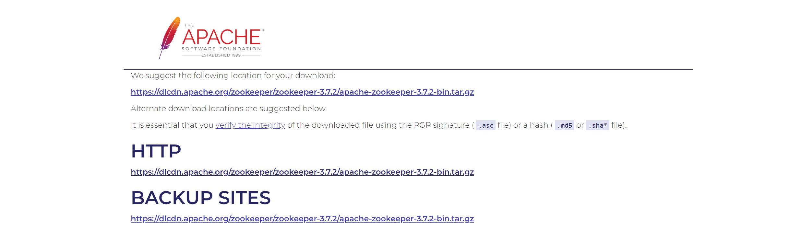
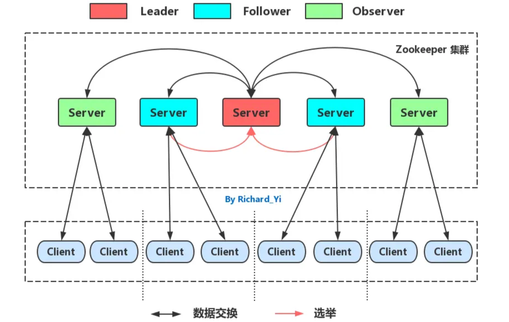
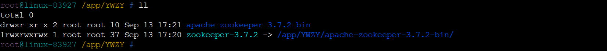

# zookeeper集群部署

## 1.下载zookeeper版本

>:mag:https://zookeeper.apache.org/releases.html
>
>:mag:https://dlcdn.apache.org/zookeeper/zookeeper-3.7.2/apache-zookeeper-3.7.2-bin.tar.gz

~~~shell
root@LC-LJGL-SKDB01 /root # wget https://dlcdn.apache.org/zookeeper/zookeeper-3.7.2/apache-zookeeper-3.7.2-bin.tar.gz
~~~

## 2.环境检查（在所有节点执行）

### 2.1.目录权限检查

1. 所有新建服务器操作系统为RHEL8.8（推荐）。
2. 所有新建服务器已单独挂载程序目录 /approot  /appdata  /applog  /esbackup。
3. 所有新建服务器的 ES 启动用户名，UID，GID 完全一致。

#### 2.1.1.目录权限配置

| 文件系统   | 格式化类型 | 容量 | 所属用户        | 所属用户组      | 权限 |
| ---------- | ---------- | ---- | --------------- | --------------- | ---- |
| /appbackup | XFS        | 30G  | appuser（2568） | appuser（2568） | 755  |
| /app       | XFS        | 50G  | appuser（2568） | appuser（2568） | 755  |

### 2.2.基础环境配置(在所有主机执行)

~~~shell
##1.创建目录
root@LC-LJGL-SKDB01 /root # mkdir -p /app /app/YWZY /appbackup 

##2.创建所属用户组和所属用户
root@LC-LJGL-SKDB01 /root # groupadd  -g 2568 appuser && useradd  -u 2568  -g 2568 appuser
root@LC-LJGL-SKDB01 /root # id appuser 
uid=2568(appuser) gid=2568(appuser) groups=2568(appuser)

##3.配置用户密码
root@LC-LJGL-SKDB03 /root #  passwd appuser

##3.创建文件系统
###3.1创建VG
root@LC-LJGL-SKDB01 /root # vgcreate  datavg  /dev/sdb{1..3}
  Physical volume "/dev/sdb1" successfully created.
  Physical volume "/dev/sdb2" successfully created.
  Physical volume "/dev/sdb3" successfully created.
  Volume group "datavg" successfully created
............省略

###3.2创建LV
root@LC-LJGL-SKDB01 /root # lvcreate -L 50G -n lv_app datavg
root@LC-LJGL-SKDB01 /root # lvcreate -L 30G -n lv_appbackup datavg

###3.3格式化
root@LC-LJGL-SKDB01 /root # mkfs.xfs   /dev/datavg/lv_app 
root@LC-LJGL-SKDB01 /root # mkfs.xfs   /dev/datavg/lv_appbackup 

###3.4挂载
............省略

###3.4目录授权
root@LC-LJGL-SKDB01 /root # chown  -R appuser:appuser /app /app/YWZY /appbackup 

root@LC-LJGL-SKDB01 /root # cat >> /etc/hosts  << EOF
192.168.1.111 LC-LJGL-SKDB01
192.168.1.112 LC-LJGL-SKDB02
192.168.1.113 LC-LJGL-SKDB03
EOF
~~~

#### 2.2.1.系统内核版本检查

~~~shell
root@LC-LJGL-SKDB01 /root # cat /etc/redhat-release 
Red Hat Enterprise Linux release 8.8 (Ootpa)

root@LC-LJGL-SKDB01 /root # uname -r    
4.18.0-477.10.1.el8_8.x86_64
~~~

#### 2.2.2.停用Swap(可选）

~~~shell
root@LC-LJGL-SKDB01 /root # swapoff -a

root@LC-LJGL-SKDB01 /root #sed -i '/swap/s/^/#/' /etc/fstab  

root@LC-LJGL-SKDB01 /root # grep  -iw swap /etc/fstab 
##/dev/mapper/rhel-swap   none                    swap    defaults        0 0
~~~

#### 2.2.3.系统优化

- 内核参数优化。

~~~shell
root@LC-LJGL-SKDB01 /root # egrep  -v "^#|^$"  /etc/sysctl.conf
kernel.sysrq = 1
vm.swappiness = 10
vm.force_cgroup_v2_swappiness = 1

####添加
root@LC-LJGL-SKDB01 /root # cat >> /etc/sysctl.conf << EOF
kernel.sysrq = 1
vm.swappiness = 10
vm.force_cgroup_v2_swappiness = 1
EOF
~~~

- 文件文件描述符优化。

~~~shell
root@LC-LJGL-SKDB01 /root # egrep  -v "^#|^$" /etc/security/limits.conf
*     soft  nofile      65535
*     hard  nofile      65535
*     soft  nproc       65535
*     hard  nproc       65535

####添加，根据需要和主机而定。
root@LC-LJGL-SKDB01 /root # cat >> /etc/sysctl.conf << EOF
*     soft  nofile      65535
*     hard  nofile      65535
*     soft  nproc       65535
*     hard  nproc       65535
EOF

####重启主机，所有主机。
root@LC-LJGL-SKDB01 /root # init 6
~~~

## 3.集群架构

### 3.1.zk集群中的角色

1. Leader 领导者 ：Leader 节点负责Zookeeper集群内部投票的发起和决议（一次事务操作），更新系统的状态；同时它也能接收并且响应Client端发送的请求。
2. Follower 跟随者 ： Follower 节点用于接收并且响应Client端的请求，如果是事务操作，会将请求转发给Leader节点，发起投票，参与集群的内部投票
3. Observer 观察者：Observer 节点功能和Follower相同，只是Observer 节点不参与投票过程，只会同步Leader节点的状态。

## 4.安装OpenJDK8 (推荐)

~~~shell
## 1.查看openJDK8版本
root@LC-LJGL-SKDB01 /root #  yum list java-1.8.0-openjdk* --showduplicates  |sort -r

## 2.安装指定openJDK8版本
root@LC-LJGL-SKDB01 /root # yum -y install java-1.8.0-openjdk-1.8.0.312.b07-2.el8_5

## 3.验证
root@LC-LJGL-SKDB01 /root # java -version
openjdk version "1.8.0_312"
OpenJDK Runtime Environment (build 1.8.0_312-b07)
OpenJDK 64-Bit Server VM (build 25.312-b07, mixed mode)
~~~

## 5.安装zookeeper

### 5.1.解压zookeeper

~~~shell
## 1.解压至/app目录
root@LC-LJGL-SKDB01 /root # tar xvf apache-zookeeper-3.7.2-bin.tar.gz  -C /app/YWZY/

## 2.设置软连接，方便后续更新版本（推荐）
root@LC-LJGL-SKDB01 /root # cd /app/YWZY
root@LC-LJGL-SKDB01 /root # ln -sv /app/YWZY/apache-zookeeper-3.7.2-bin/  /app/YWZY/zookeeper-3.7.2

## 3.创建数据目录 data
[root@linux-29051 zookeeper-3.7.2]# mkdir /app/YWZY/zookeeper-3.7.2/data

## 4.验证
~~~

### 5.2.配置zoo.cfg文件

~~~shell
root@LC-LJGL-SKDB01 /app/YWZY/zookeeper-3.7.2 # cd /app/YWZY/zookeeper-3.7.2/conf
root@LC-LJGL-SKDB01 /app/YWZY/zookeeper-3.7.2/conf # cp -p zoo_sample.cfg  zoo.cfg 
~~~

~~~shell
root@LC-LJGL-SKDB01 /app/YWZY/zookeeper-3.7.2/conf # cat > zoo.cfg << EOF
tickTime=2000
initLimit=10
syncLimit=5
dataDir=/app/YWZY/zookeeper-3.7.2/data
clientPort=2181
autopurge.snapRetainCount=3
autopurge.purgeInterval=24
server.1=192.168.1.111:2888:3888
server.2=192.168.1.112:2888:3888
server.3=192.168.1.113:2888:3888
EOF
~~~

### 5.3.创建集群id

~~~shell
## 每台主机分别执行
root@LC-LJGL-SKDB01 /app/YWZY/zookeeper-3.7.2/conf # echo 1 > /app/YWZY/zookeeper-3.7.2/data/myid 
root@LC-LJGL-SKDB02 /app/YWZY/zookeeper-3.7.2/conf # echo 2 > /app/YWZY/zookeeper-3.7.2/data/myid 
root@LC-LJGL-SKDB03 /app/YWZY/zookeeper-3.7.2/conf # echo 3 > /app/YWZY/zookeeper-3.7.2/data/myid 
root@LC-LJGL-SKDB01 /root # chown  -R appuser:appuser /app /app/YWZY /appbackup 
~~~

## 6.启动zookeeper

### 6.1.配置zk环境变量

~~~shell
## 1.配置
root@LC-LJGL-SKDB01 /app/YWZY/zookeeper-3.7.2/conf # cat > /etc/profile.d/zk.sh << "EOF"
ZK_HOME=/app/YWZY/zookeeper-3.7.2
PATH=$PATH:$ZK_HOME/bin
EOF

## 2.加载文件
root@LC-LJGL-SKDB01 /app/YWZY/zookeeper-3.7.2/conf # source /etc/profile.d/zk.sh 

##3.验证
~~~

### 6.2.启动zk

~~~shell
## 1.启动
root@LC-LJGL-SKDB02 /app/YWZY/zookeeper-3.7.2/conf # zkServer.sh start
/usr/bin/java
ZooKeeper JMX enabled by default
Using config: /app/YWZY/zookeeper-3.7.2/bin/../conf/zoo.cfg
Starting zookeeper ... STARTED

## 2.查看集群状态
root@LC-LJGL-SKDB03 /app/YWZY/zookeeper-3.7.2/bin # zkServer.sh status
/usr/bin/java
ZooKeeper JMX enabled by default
Using config: /app/YWZY/zookeeper-3.7.2/bin/../conf/zoo.cfg
Client port found: 2181. Client address: localhost. Client SSL: false.
Mode: leader
~~~

